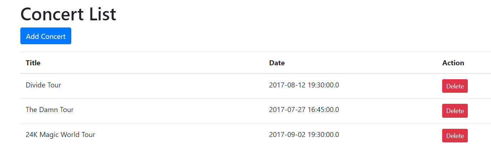

 Web Lab - Spring Data with MVC
 ====================
In this lab, we will develop a web application using Spring Data with MVC. We will use Spring Data JPA to store and retrieve data in a relational database. We will use Spring MVC to handle HTTP requests and render HTML views. We will use Thymeleaf to render HTML views. We will use Spring Boot to develop the web application.

## Develop Model
We will develop a model class `Concert` that will represent a concert. It should have annotation for JPA such as `@Entity`. The class will have the following attributes:
* `id`: This attribute will store the unique id of the concert. This attribute should have `@Id` and `@GeneratedValue` that has `GenerationType.IDENTITY`.
* `title`: This attribute will store the name of the concert.
* `date`: This attribute will store the date of the concert.

You need to generate getter/setters method for these attributes.

You neeed to create two constructors:
* `Concert()`: This is the default constructor.
* `Concert(String title)`: This is the parameterized constructor.

There is `data.sql`, which initializes the database with some data. You can use this data to test your application.


## Develop Repository
We will develop a repository class `ConcertRepository` that will manage the data. The repository will extend `CrudRepository` interface. Currently, we do not need any method in the repository. We will use the methods provided by `CrudRepository` interface.

We will use H2 as a database for this lab. Add the following to the `application.properties` file under `src/main/resources` folder:
```
spring.datasource.url=jdbc:h2:mem:testdb
spring.datasource.driverClassName=org.h2.Driver
spring.datasource.username=sa
spring.datasource.password=password
spring.jpa.database-platform=org.hibernate.dialect.H2Dialect
spring.jpa.show-sql = true
spring.jpa.defer-datasource-initialization=true
spring.jpa.hibernate.ddl-auto=create
spring.datasource.initialization-mode=always
spring.jpa.hibernate.naming.physical-strategy=org.hibernate.boot.model.naming.PhysicalNamingStrategyStandardImpl
```

## Develop Controller
This controller is similar to the previous lab, except it uses `ConcertRepository` to manage data, instead of `HashMap`. 
We will develop a controller class `ConcertController` that will handle the HTTP requests. 

- The controller must have a contructor that takes `ConcertRepository` as a parameter. 

- The controller will have the following methods:
  * `listConcerts`: This method will handle the HTTP GET request to `/concerts` URL. It will return the `concerts` view that will display the list of concerts.
  * `addAConcertForm`: This method will handle the HTTP GET request and return the `add-concert-form` view that will display the form to add a new concert.
  * `getConcert`: This method will handle the HTTP GET request to `/concerts/{id}` URL. It will return the `add-concert-form` view that will display the concert and allow user to save.dd
  * `saveConcert`: This method will handle the HTTP POST request to `/concerts` URL. It will save the concert in the database and redirect to the `concerts` to list all concerts.
  * `deleteConcert`: This method will handle the HTTP GET request to `/delete-concert/{id}` URL. It will delete the concert with the given id and redirect to the `concerts` to list all concerts.
  * `removeAllConcerts`: This method will handle the HTTP GET request to `/delete-concert` URL. It will delete all concerts and redirect to the `concerts` to list all concerts.

## Develop Views
We will develop the following views:
* `list-concerts.html` view: This view will display the list of concerts. It will have the following features:
  * It will display the list of concerts in a table.
  * It will have a link to delete a concert.
  * It will have a link to add a new concert.
  * It will have a link to delete all concerts.
* `add-concert-form.html` view: This view will display the form to add a new concert. 

## Test Web App using Browser
Run the application using App.java class. Open the browser and go to the following URL:
```
http://localhost:8100/concerts
```
or if you use codespace
```
https://<your-codespace-name>-8100.githubpreview.dev/concerts
```
You should be able to add concert, list all concerts, delete a concert and delete all concerts.

## Modify the Web App to use Bootstrap
**Our UI looks ugly now.** :no_good: Please modify the views to use Bootstrap. You can use the following links to learn about Bootstrap:
* [Bootstrap](https://getbootstrap.com/)
* [Bootstrap Tutorial](https://www.w3schools.com/bootstrap4/default.asp)

You can use ChatGPT to help. Try to experiment by copying code in `list-concerts.html` and `add-concert-form.html`. Then prompt to modify the code such as: "`Modify the code to use Bootstrap and convert list to table.`" Below is sample UI.



## Unit Test
Run the unit tests in `ConcertControllerTest` class to test the service. You can run the tests using the following command:
```
mvn verify
```
